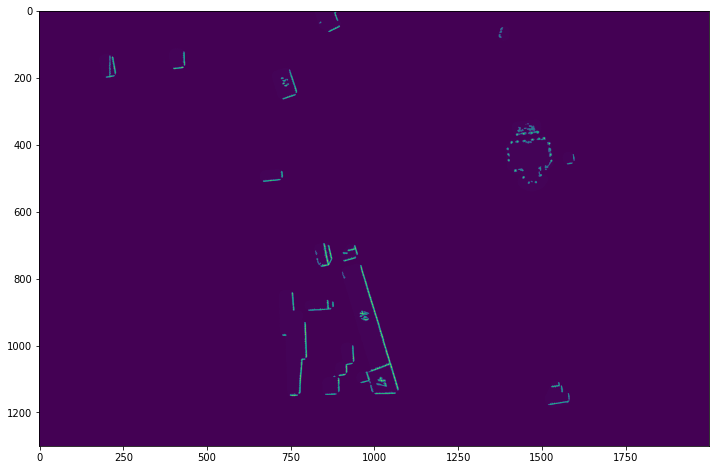
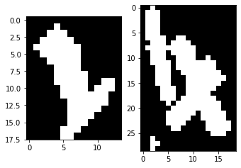

```python
import numpy as np
import cv2
import os

from skimage.io import *
from skimage.color import *
from skimage.filters import *
from skimage.morphology import * 
from skimage.transform import *
from skimage.feature import *
from skimage.measure import *
from skimage.draw import line_aa
from skimage import data
from scipy.ndimage.morphology import distance_transform_edt

import matplotlib.pyplot as plt
```

# Jacoubet Atlas of Paris
* Audran Doublet
* Sami Issaadi
* Amélie Bertin
* Matthew Rousseau

The purpose of this notebook is to extract street numbers from Jacoubet Atlas of Paris

**Example**


```python
im = imread("example.jpg")

plt.figure(figsize=(12,12))
plt.imshow(im)
```


    <matplotlib.image.AxesImage at 0x7f860fcced68>


---

The notebook (and project) is divided in 8 major steps:

* grid detection
* striped houses removal
* road segmentation
* number heatmaps retrieval
* digit segmentation
* digit labelization
* number merging
* postprocessing 

--- 
# Step 1: grid detection

This step is a processing step. Its purpose is extracting the background grid from maps.

This step is useful for two reasons:
* the grid can be useful information for a human reader, but in our case, it's noise
* retrieving the grid enables us to differentiate the map from the background (containing a lot of noise: title, non-street digits ...)

## How it works

* We retrieve line candidates using morphological erosion, as the seeked lines are nearly verticals/horizontals
* We filter noise from the candidates
* The grid line will then have holes, so we use a linear regression to retrieve the real line with a good accuracy (using a RANSAC regressor as there is still noise)
* Moreover, we allow the line to be a curve, as grid lines are not perfectly straight. To achieve that, we use polynomial features of degree 3

## How it could have been improved

The used method is unecessary complex, as the Hough Line transform algorithm can solve the problem. Moreover, this step is very time consuming (~1mn/per sample), and using Hough Lines could save a lot of time.

Nevertheless, the results are nearly perfect for our use.

**Grid**


```python
im = imread("01_grid.png")

plt.figure(figsize=(12,12))
plt.imshow(im)
```


    <matplotlib.image.AxesImage at 0x7f860fed3470>


**Exterior**


```python
im = imread("01_exterior.png")

plt.figure(figsize=(12,12))
plt.imshow(im)
```


    <matplotlib.image.AxesImage at 0x7f860fe35240>


--- 
# Step 2: striped houses removal

This step is a processing step.

The map contains houses which are striped. But these houses can contain digits, which will be hard to detect for the next steps.

For this reason, this step's purpose is to remove the background of striped houses and highlight the numbers.

# How it works

After seeking a while for a complex solution, for example trying to detect periodic noise using Fourier transform, or to detect background lines using Hough Lines...

* We segment striped houses from the map using morphological opening
* We apply a gaussian blur on striped houses
* We binarize the obtained image: the foreground should be kept, the background removed from the original image

# How it could have been improved

Currently, the results of these steps are far from being perfect: there are many cases where the simple binarization is not effective. We probably could have found a better way to binarize, and thus to remove this noise.

Moreover, finding the striped houses is time consuming as it uses a morphological operation with a big element (~ 30x30).


```python
im = imread("atlas_4.jpg")[5100:6400,1500:3500,:]
im = 1 - rgb2gray(im)
plt.figure(figsize=(12,12))
plt.imshow(im)
```


    <matplotlib.image.AxesImage at 0x7f25ea7a40b8>


```python
def get_striped_house_candidates(binary):
    closed = binary_closing(binary, disk(3))
    closed = binary_opening(closed, disk(15))

    return remove_small_objects(closed, 1024)

mask_striped_house_candidates = get_striped_house_candidates(binary_dilation(im > threshold_otsu(im)))
_plt_im = gray2rgb(im)
_plt_im[:,:,0][mask_striped_house_candidates] = 1
plt.figure(figsize=(12,12))
plt.imshow(_plt_im)
```


    <matplotlib.image.AxesImage at 0x7f25ea621780>


```python
def clean_striped_houses(image, mask_striped_house_candidates):
    image = image.copy()
    image[~mask_striped_house_candidates] = 0

    blurred = gaussian(1-image, sigma=2)
    mask = remove_small_objects(blurred < 0.65, 10) | np.bitwise_not(mask_striped_house_candidates)

    image[mask<1] = np.mean(image.reshape(-1, 1), axis=0)
    return image

_plt_im = clean_striped_houses(im, mask_striped_house_candidates)
plt.figure(figsize=(12,12))
plt.imshow(_plt_im)
```


    <matplotlib.image.AxesImage at 0x7f25e9fd1438>





--- 
# Step 3: Road segmentation

This step is a processing step.

His goal is to segments roads from the other places. This has two main purposes:
* we are seeking for street numbers. But street numbers are not in roads nor far from roads. So this mask can be used to remove a lot of noise from the image
* an important problem is to find the right rotation of numbers, as an OCR (or even human reader) can have difficulties to read a number with a wrong rotation (for example, good luck with 6/9). Street segmentation can be used to solve this problem, as numbers are aligned to streets

## Why is it difficult

Color cannot be used to segment the roads, as houses and roads have the same color. Moreover, the data is far from being perfect, and there is small holes in lines that makes this task even harder.

## What have we tried?

First, we tried to binarize the image, inverse it, and keep only the biggest connex component, which should be the road system. After some adjustements, it works pretty well but their is two major issues:
* there are unintentional holes in the roads, that make us takes more houses
* on some samples, there are unintentional noise that cut the road system in two
* there are intentional holes in the roads, that make us takes more houses :(
* on some samples, there are intentional noise that cut the road system in two :(

## What have we done?

So we've given up this idea. The second idea is a bit more complex:
* we binarize the image and remove unwanted small objects, we should mainly be text
* we compute a distance map of the components
* we compute the watershed of this distance map, to obtain the "small axis" of the components
* we compute the edges of this, to obtain a mask containing new borders
* we add this edges with the original binarize image. This makes possible to obtain an image with the holes closed
* we filter unwanted components, which it easier now that the holes are closed

**After distance map**


```python
im = imread("distance_map.png")

plt.figure(figsize=(12,12))
plt.imshow(im)
```


    <matplotlib.image.AxesImage at 0x7f8611e17dd8>


**After watershed**


```python
im = imread("distance_watershed.png")

plt.figure(figsize=(12,12))
plt.imshow(im)
```


    <matplotlib.image.AxesImage at 0x7f860fe45550>


**Result**


```python
im = imread("02_road_mask.png")

plt.figure(figsize=(12,12))
plt.imshow(im)
```


    <matplotlib.image.AxesImage at 0x7f860fcecf60>


## How it could have been improved?

The algorithm works quite well. But the most unstable part is clearly the last one, which has hardcoded hyperparameters. We could have used a machine learning algorithm (for examples random forest ?) instead of doing it by hand.

--- 
# Step 4: Numbers detection

One of the most important task of this is project is the **detection of the locations of the numbers**, and other relevant information like their size and rotation.


## Why is it difficult?

The presence of several characters, figures and stains of similar shapes and dimension from actual numbers makes the task non-trivial. 
We could not find any obvious discriminant factor to easily distinguish numbers from noise. 

## What have we tried?

We thought of different ideas:
- neural network heatmap detection: the idea is to train a NN to detect if an image contains a digit, and it would output a value between 0 and 1 (0 if there are not any digits, 1 if there is certainly a digit). If the output confidence is superior to a threshold, we color the areas of the image depending on how much they have contributed in the increase of the NN output. By applying this model on slices of the image, we get a heatmap of the numbers area: we did not implement that algorithm because synthesizing training data was tricky, but it could have been done with a GAN.
- well-aligned (following main road lines orientation) template matching with multiple templates: rotation invariant but sensible to the scale + too much false positives
- corners matching: detecting all corners in the atlas, saving corners that have neighbours such that they form "shapes" similar to the shapes made by the corners of the digit templates: we gave up since it appeared too hard to implement, it could have been rotation and scale invariant, but would certainly be too noisy

But in a first place, we tried to keep only small connex componants and filter them to keep only those which looks like numbers. It worked pretty well, but removed all numbers which are connected to a line.


## What have we done?

The selected solution is finally simpler than the other ideas. 
We first create a mask of the junctures of the map, then we dilate the image so that close digits (potentially numbers) blend together into a blob, we then cut the image using the junctures we have previously extracted, and finally we filter all blobs that cannot be numbers using a simple criterion.


```python
im = imread("atlas_11.jpg")[3500:5500,3000:5900,:]
im = 1 - rgb2gray(im)
im_bin = gaussian(im) > threshold_otsu(im)

plt.figure(figsize=(12,12))
plt.imshow(im)
```


    <matplotlib.image.AxesImage at 0x7f4163ec3d68>


### Grid removal


```python
def im_detect_grid(im, dilation_selem=disk(2), line_length=800, line_gaps=10):
    im = binary_dilation(im, dilation_selem)

    lines = probabilistic_hough_line(im, line_length=line_length, line_gap=line_gaps)
    grid_mask = np.zeros_like(im, dtype=np.bool)

    for p0, p1 in lines:
        # ignore diagonal lines
        a = (p1[0]-p0[0]) / ((p1[1]-p0[1]) or float('nan'))
        if abs(a) > 1e-2:
            continue
        rr, cc, val = line_aa(*p0[::-1], *p1[::-1])
        grid_mask[rr, cc] = True
    
    return grid_mask

mask_grid = im_detect_grid(im_bin)
im[mask_grid] = 0
im_bin[mask_grid] = 0

plt.figure(figsize=(12,12))
plt.imshow(im)
```


    <matplotlib.image.AxesImage at 0x7f4163d03d68>


### Junctures extraction


```python
mask_junctures = im
# edge detection
mask_junctures = canny(mask_junctures, sigma=2.5)
# dilation to fill small holes on edges
mask_junctures = dilation(mask_junctures)
# naive image binarisation
mask_junctures = mask_junctures > 0.1
# remove small objects to preserve junctures only
mask_junctures = remove_small_objects(mask_junctures, min_size=1024)

mask_junctures_area = -distance_transform_edt(1-mask_junctures) > -50

_plot_img = gray2rgb(mask_junctures.astype(dtype=np.float))
_plot_img[:,:,2][mask_junctures_area] = 1

plt.figure(figsize=(12,12))
plt.imshow(_plot_img)
```


    <matplotlib.image.AxesImage at 0x7f4163c62668>


### Blobs detection


```python
blobs = im_bin
# dilation to merge close digits into blob
blobs = binary_dilation(blobs, disk(5))
# remove some noise: blobs to far from junctures
blobs &= mask_junctures_area
# split blobs using junctures
blobs &= ~mask_junctures

plt.figure(figsize=(12,12))
plt.imshow(blobs)
```


    <matplotlib.image.AxesImage at 0x7f4163b1c1d0>


### Filtering


```python
def area_ecc_filter(im, area_bounds, ecc_bounds, ext_bounds=(0.0, 1.0)):
    # Extract the region props of the objects. 
    props = regionprops(im)

    # Extract the areas and labels.
    areas = np.array([prop.area for prop in props])
    eccs = np.array([prop.eccentricity for prop in props])
    labels = np.array([prop.label for prop in props])
    extents = np.array([prop.extent for prop in props])

    # Make an empty image to add the approved cells.
    im_approved = np.zeros_like(im)

    # Threshold the objects based on area and eccentricity
    for i, _ in enumerate(areas):
        if areas[i] > area_bounds[0] and areas[i] < area_bounds[1]\
            and eccs[i] > ecc_bounds[0] and eccs[i] < ecc_bounds[1]\
            and extents[i] > ext_bounds[0] and extents[i] < ext_bounds[1]:
                im_approved += im==labels[i]

    return im_approved > 0

blobs_filtered = erosion(blobs, star(3))
blobs_filtered = area_ecc_filter(label(blobs_filtered), (50, 1000), (0., 1.0), (0.3, 1.0))

_plot_img = gray2rgb(im.astype(dtype=np.float))
_plot_img[:,:,0][blobs_filtered] = 1
plt.figure(figsize=(15,15))
plt.imshow(_plot_img)
```


    <matplotlib.image.AxesImage at 0x7f41655525f8>


In the original version, we also take use of the road segmentation to filter more noise too far away or inside the road. Moreover, we also use **Hough Lines** detection to remove the small aligned objects that form a line long enough to be considered as noise.

## Further improvements

The major issue with this solution is that numbers too close from the junctures are detected as juncture, we thus lose them after the blob cutting step. However, it should be possible to improve the juncture detections by filtering shapes/lines that are not orthogonal to the road. With a better juncture detection, this method should be sufficient to detect all numbers in the image.


--- 
# Step 5: Segmentation

Given the heatmaps of numbers from the previous step, we want to separate numbers into single digits, which will then be fed to the classification CNN.

## How it works

* First, we extract the connected components from the heatmaps image and get their properties in the image (like their bounding box coordinates)

```python
from skimage.measure import label, regionprops
def get_objects(img):
    """
    Find the connected components and get their properties in the image
    """
    props = []
    objs = []
    label_image = label(img)

    for i, region in enumerate(regionprops(label_image)):
        bbox = region.bbox
        rect = ((bbox[1], bbox[0]), (bbox[3], bbox[2]))

        new_obj = np.zeros(shape=(bbox[2] - bbox[0], bbox[3] - bbox[1]), dtype=bool)
        new_obj[label_image[bbox[0]:bbox[2], bbox[1]:bbox[3]] == (i + 1)] = True

        props.append(region)
        objs.append(new_obj)

    return objs, props
```

* We apply these bounding boxes on the original image and binarize the results

```python
from skimage.color import rgb2gray
from skimage.morphology import binary_dilation

from grid_detection import otsu_image

def apply_mask_binary(original, mask, prop):
    segment = rgb2gray(original[prop.bbox[0]:prop.bbox[2], prop.bbox[1]:prop.bbox[3]])
    bin_segment = binary_dilation(otsu_image(segment))

    bin_segment[~mask] = 0

    return bin_segment
```

* We classify the images into 2 categories: single and multiple number images. For example: [`3`, `25`, `102`, `7`, `10`] -> single: [`3`, `7`] and multiple: [`25`, `102`, `10`]

* Then, we cut the "multiple" images into single digits, and we give them an id to retrieve the full number later. Ex: `23` is transformed into `2` and `3` with the same `merge_id`.

```python
def cut_image(original_img, prop, nb_labels):
    """
    Extract the numbers with their contour and
    try to draw a line to separate connected numbers
    """

    height, width = original_img.shape
    # cut the object with a line
    bounds_a = (-10, 10) # orientation of the line
    bounds_b = (0, 3 * width // 4)
    results = []

    # a negative
    for a in range(bounds_a[0], 0, 1):
        origin = 0
        for b in range(bounds_b[0], bounds_b[1]): # top bound
            # copy the image to not modify it
            tmp = np.copy(original_img)
            nb_pixels = 0
            # draw line = set white pixels to black
            for x_0 in range(0, width - b):
                y = origin - a * x_0
                x = x_0 + b

                y2 = origin - (a * (x_0 + 1))
                yend = min(y2, height)
                while y < yend:
                    if tmp[y][x]:
                        tmp[y][x] = 0
                        nb_pixels += 1
                    y += 1

            add_result(tmp, nb_pixels, results, prop)
            # Add the cut into `results` list if it's a "good" cut (into 2 or more objects and good proportions)

    # a positive
    for a in range(0, bounds_a[1], 1):
        origin = height - 1
        for b in range(bounds_b[0], bounds_b[1]): # bottom bound
            # copy the image to not modify it
            tmp = np.copy(original_img)
            nb_pixels = 0

            # draw line = set white pixels to black
            for x_0 in range(0, width):
                y = origin - a * x_0
                x = x_0 + b
                if x >= width:
                    break

                y2 = origin - a * (x_0 + 1)
                yend = max(y2, 0)
                while y > yend:
                    if not tmp[y][x]:
                        tmp[y][x] = 0
                        nb_pixels += 1
                    y -= 1

            add_result(tmp, nb_pixels, results, prop)

    return pick_results(results, nb_labels)  # Choose the best result: less changed pixels (minimum cut) and give the `merge_id`
```

* We also apply some filters to remove noise (like too small images, images with a really different shape from others, etc)


```python
import segmentation
```


```python
# show extracted bounding boxes

heatmapFile = "03_heatmaps.png"
inputFile = "Atlas_de_Jacoubet_-_11._Hospice_Beaujon_et_ses_environs_-_BHVP.jpg"

heatmap = segmentation.load_image(heatmapFile)
images, props = segmentation.get_objects(heatmap)

mid = len(images) // 2 + 1

print("Extracted object example:")
segmentation.show_images([images[mid]])
print("Property:", props[mid].__dict__)

bbox = props[mid].bbox
print("\nBbox:", bbox)

original = segmentation.load_image(inputFile)
print("\nOn original image:")
segmentation.show_images([original[bbox[0]:bbox[2], bbox[1]:bbox[3]]])
```

    Extracted object example


    Property: {'label': 111, '_slice': (slice(4624, 4654, None), slice(1240, 1274, None)), 'slice': (slice(4624, 4654, None), slice(1240, 1274, None)), '_label_image': array([[0, 0, 0, ..., 0, 0, 0],
           [0, 0, 0, ..., 0, 0, 0],
           [0, 0, 0, ..., 0, 0, 0],
           ...,
           [0, 0, 0, ..., 0, 0, 0],
           [0, 0, 0, ..., 0, 0, 0],
           [0, 0, 0, ..., 0, 0, 0]]), '_intensity_image': None, '_cache_active': True, '_cache': {}, '_ndim': 2}
    
    Bbox: (4624, 1240, 4654, 1274)
    
    On original image:


```python
# show classification results: 2 images per category

# binarize images
bin_images = [segmentation.apply_mask_binary(original, mask, prop) for mask, prop in zip(images, props)]
# remove some noise
bin_images, props2, suppr = segmentation.remove_noise(bin_images, props)
# classify the images
singles, multiples, single_prop, mult_prop = segmentation.extract_single_numbers(bin_images, props2)

mid_s = len(singles) // 2
mid_m = len(multiples) // 2

print("Singles:")
segmentation.show_images(singles[mid_s:mid_s + 2])
print("\nMultiples:")
segmentation.show_images(multiples[mid_m:mid_m + 2])
```

    Singles:





    
    Multiples:


```python
# show a cut: before and after images

k_img = mid_m + 1

length = len(singles) + len(multiples)
res, res_props, length = segmentation.cut_image(multiples[k_img], mult_prop[k_img], length)

print("Before:")
segmentation.show_images([multiples[k_img]])

print("After:")
segmentation.show_images(res)
```

    Before:


    After:


## What are the encountered difficulties?

This step is crucial in the algorithm. Indeed, a wrong cut of the digits can make a huge difference for the following classification step.

A problem we encountered was the binarization of the digits before cutting numbers apart. Here we use a simple otsu threshold to binarize the numbers. However, the numbers are quite small, so using morphological operations to clean the result can easily destroy digits, or merge multiple digits into one.

## What have we done ?

We have chosen the best empirical compromise of morphological operations to separate digits while keeping their integrity.

We have also tried other binarization thresholds, such as Sauvola. We have found that Otsu gives the best results.


--- 
# Step 6: Digits labelling

After having detected numbers and splitted them into digits, we need to recognize what those digits are.
The font used was always the same, so this task was not too complicated.


## What are the encountered difficulties?

The previous tasks are not perfect and may output noises, so we still have to filter as best as we can. Moreover, even if it is possible to find the rotation of the digit, determining its scaling is not trivial since it can vary for a same digit inside one image. And to make it funnier, the characters drawing vary as well, but not that much.


## What have we tried?

To solve the issue of labelling digits and discarding noise, we thought of two pathways:

Given that the digit is correctly rotated (rotation-invariance), **template matching** appeared to be a sufficient solution: we match the digit it with the 10 templates (templates of digits from 0 to 9) and select the one that outputs the highest signals, and if all signals are inferior to a threshold, we consider that the digit is just noise and discard it. Nevertheless, the fact that the digit scales and drawing could slightly vary made this solution unlikely to work correctly. We finally decided to switch to another solution.


## What have we done?

The most robust and easiest solution we could think of was using a **convolutionnal neural network** to detect the class of a digit image. 

### Training dataset
We train a CNN over a dataset similar to **MNIST** called [**E-MNIST**](https://www.nist.gov/itl/products-and-services/emnist-dataset) that contains written digits and letters.

### Model purpose

The goal of the model is to distinguish digits from noise (letters, houses structures, random shapes...). 
It outputs 11 classes: from 0 to 9 for digits, and 10 for noise.

### Model description

The used model is a simple CNN structure:
```python
 model = Sequential([
        GaussianNoise(0.1, input_shape=(28, 28, 1)),
        Conv2D(64, kernel_size=(3,3), activation='relu', input_shape=(28, 28, 1)),
        Conv2D(128, (3, 3), activation='relu'),
        MaxPooling2D(pool_size=(2, 2)),
        Dropout(0.25),
        Conv2D(64, kernel_size=(3,3), activation='relu', input_shape=(28, 28, 1)),
        Conv2D(128, (3, 3), activation='relu'),
        Dropout(0.15),
        Flatten(),
        Dense(128, activation='relu'),
        Dense(10, activation="softmax")
    ])
```

We did not feel the need to investigate more on the model, this one appeared to be light enough and to perform correctly.

### Data Augmentation

The frames taken from the Jacoubet Atlas of Paris often are noisy, hence the need to augment the data we train the model on. Here is the list of the applied random transformations on the image:
- horizontal/vertical shift
- rotation (15 degree max)
- shear transformation
- gaussian noise
- zoom
- paper stain synthesis

### Training step

The used dataset being highly imbalanced (the noise class contains more samples than the digit classes), the training step could not be done straightforwardly. The following pseudo-code is better than long explanations:

```
for i in range(0, CST_NUMBER_OF_TRAINING_ITER):
    > train model on dataset containing digits only
    > train model on dataset containing digits and noise
train model on dataset made from Jacoubet Atlas of Paris samples
```

To summarize, we first train the model to recognize the digits, and then we train it to distinguish the different digits from noise, we iterate over this process until we get reasonnable results (\~95% on digits only dataset, \~85% on the mixed dataset). Once we have a general model, we specialize it on a small dataset made from samples taken from the Jacoubet Atlas of Paris (\~300 samples), on which the model performs an accuracy of 99.5%.


## Inference step

Let's run our CNN! We are using samples from our pipeline which previously segmented the digits, and applied the measured rotation.


```python
from keras.models import load_model

# Load the model
model = load_model('keras_brain3')
```


```python
import glob
from skimage.transform import resize

SEGMENTATION_IMGS = glob.glob('segmentations/*')

# Read images and resize to size (28, 28) to be fed to neural net
seg_imgs = [resize(imread(img), (28,28), anti_aliasing=False) for img in SEGMENTATION_IMGS]
```


```python
# Display classification results
plt.figure(figsize=(16, 16))
num_imgs = len(seg_imgs)
for i, img in enumerate(seg_imgs):
  pred = model.predict_classes(img.reshape(1, 28, 28, 1))[0]
  if pred == 10:  # Class #10 represents noise
    pred = 'noise'
  plt.subplot(num_imgs // 4 + 1, 4, i + 1)
  plt.imshow(img, cmap='gray')
  plt.title(f'Predicted class: {pred}')
  plt.axis('off')
```


## How can it be improved?

Set apart from tweaking the model structure, there is no other evident way of improving the performance of this solution. However, it seems like an overkill solution for such problem. A greater investigation on the **template matching** solution may have lead to similar results.


```python

```

---
# Conclusion

After having applied all of these 8 steps to the given dataset samples, our solution obtained a Levenshtein Mean of 0.01971 (first on the leaderboard, yay!). 

## Limits and improvements

Our solution has given quite a good score, but is not perfect. There are still numbers which are misclassified or numbers which are simply not detected at all (see results below).
We have seen previously that almost every step of the algorithm can be tweaked and enhanced to get an overall better performance.

- The blob detection is relatively robust, a few shapes are recognized as digits but the neural net catches any non-digit characters.
- The segmentation step is difficult to generalize to all characters, and is a big source of misclassification in our algorithm.
- Using template matching to recognize digits could be a good lead to replace the classification CNN.

We have also had some ideas to improve the performance of the algorithm after the detection step such as "guessing" the current house number using the surrounding numbers on the same street.


You will find here the code to run our algorithm on an atlas image.
Or with bash:
```bash
python3 inputs/ results/ data/keras_brain3
```


```python
from pipeline import Pipeline

# Change input path to desired image
input_path = 'Atlas_de_Jacoubet_-_11._Hospice_Beaujon_et_ses_environs_-_BHVP.jpg' 
output_path = 'output'
model_path = 'keras_brain3'

# Run the pipeline
pipeline = Pipeline(input_path, output_path, model_path).run()
```
